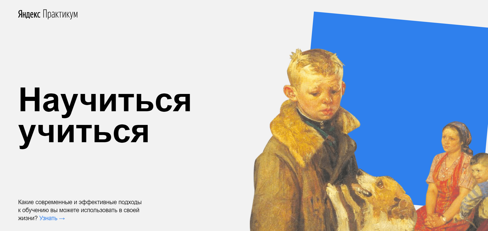

# Научиться учиться
Лэндинг о способах учиться эффективнее, о том как себя замотивировать, как не останавливаться в развитии.

## Особенность проектной работы
* Содержит анимацию и трансформацию элементов страницы.
* Содержит блок с видео, встроеное при помощи iframe из Youtube.
* Сайт создан по методологии BEM с файловой структурой Nested BEM.

## Технологии
* Flexbox ang Grid
* Positioning Elements
* Animation and Transform using CSS
* Iframe
* BEM Methodology

## План по доработке проекта
* Добавить плейлист с аудио-лекциями при помощи iframe из Яндекс.Музыка.
* Добавить адреса ссылкам вместо заглушек.
* Добавить адаптивность для разрешений 768px и 320px.
